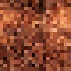
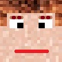

# Modeling and rendering with boxes - Fuccaro

![Preview Image of Project][id_prev]

##  Esecuzione

Per una corretta visualizzazione è necessario l'utilizzo di un web server, per esempio Xampp. Per ulteriori informazioni consultare la documentazione Threejs alla pagina [How to run things locally](https://threejs.org/docs/#manual/introduction/How-to-run-things-locally).

## Introduzione

All'avvio si presenta una scena, costruita esclusivamente da oggetti di tipo Boxes, con un labirinto, al cui centro troviamo un omino che durante l'animazione seguira un percorso verso l'uscita dal labirinto stesso. Più a destra troviamo un minotauro inanimato. L'animazione può essere controllata dall'utente, sia tramite tastiera (avviare, bloccare, resettare l'animazione) che tramite appositi controlli posti nella parte alta della schermata.

## Progettazione e Realizzazione

### Scenegraph

La prima fase della progettazione ha riguardato la costruzione dello Scenegraph, per facilitare la realizzazione del progetto finale e le relative animazioni.

### Personaggi

I due personaggi, l'omino e il minotauro, sono stati inizialmente progettati tramite schizzo su carta per poi essere riportati graficamente tramite l'[editor](https://threejs.org/editor/) Threejs, per avere una prima idea del risultato finale.

### Labirinto

Per la costruzione del labirinto è stata utilizzata una heightmap, reperita tramite il sito [Maze Generator](http://www.mazegenerator.net/) dove è possibile generare labirinti. Siccome l'immagine presentava una risoluzione troppo eleavata è stato necessario ridurne le dimensioni ad una 90x90px tramite il tool online [reduceimages](https://www.reduceimages.com/). Inoltre è stato necessario invertire i colori dell'immagine, per questo è stato utile il tool [pinetools invertimagecolors](http://pinetools.com/invert-image-colors).

Tramite Maze Generator è stato possibilie scaricare anche l'immagine con la soluzione. In questo caso è stato necessario eliminare il profilo del labirinto (tramite [Gimp](https://www.gimp.org)) e come fatto anche per il labirinto invertire i colori. L'utilizzo di questa heightmap verra trattato successivamente.

<table>
<tr>
<td>
<figure>

 
<figcaption>Immagine originale</figcaption>
</figure>
</td>
<td>
<figure>

 
<figcaption>Heightmap labirinto</figcaption>
</figure>
</td>
<td>
<figure>

 
<figcaption>Heightmap soluzione* </figcaption>
</figure>
</td>
</tr>
</table>

\* a differenza dell'originale, è stata apportata una modifica per permettere al omini di partire dal centro del labirinto.

### Textures

Agli oggetti della scena sono state aggiunte delle textures:
- Ad ogni texture è stato voluto dare l'effetto 8-bit, per farlo sono state prima ridotte ad una risoluzione 20x20px e alla fine aumentate a 90x90px.

<table>
<tr>
<td>
<figure>

 
<figcaption>Texture labirinto</figcaption>
</figure>
</td>
<td>
<figure>

 
<figcaption>Texture pelle umana</figcaption>
</figure>
</td>
<td>
<figure>

 
<figcaption>Texture pantaloni/jeans</figcaption>
</figure>
</td>
<td>
<figure>

 
<figcaption>Texture pelo minotauro</figcaption>
</figure>
</td>
</tr>
</table>

- Per le teste dell'omino e del minotauro sono state create delle texture a partire da quella delle pelle umana e del pelo, per poi aggiungere tramite Gimp gli occhi e la bocca o il muso.

<table>
<tr>
<td>
<figure>

 
<figcaption>Texture volto omino</figcaption>
</figure>
</td>
<td>
<figure>

 
<figcaption>Texture volto minotauro</figcaption>
</figure>
</td>
</tr>
</table>

### Animazione

L'animazione, controllabile dall'utente, consiste nel mostrare l'omino, inizialmente posto al centro del labirinto, muoversi verso l'uscita seguendo un percorso prestabilito. Per questa animazione è stata utilizzata la heightmap con la soluzione del labirinto. L'animazione è stata costruita seguendo le seguenti regole:
- Il labirinto è astrattamente suddiviso allo stesso modo di una scacchiera 90x90.
- Per lo stesso principio, viene creata una matrice 90x90 di interi con valore 1 (la cella appartiene al percorso) e 0 (altrimenti) a ricreare il percorso verso l'uscita.
- Partendo dalla posizione centrale (coordinate 45,45) si controlla quale casella adiacente (anche in diagonale) ha valore 1, trovata la casella corrispondente si muove l'omino verso la direzione corretta.
- Per evitare che l'omino possa tornare in dietro, prima di proseguire nel controllo, si setta a 0 la cella della matrice in cui l'omino è stato spostato.
- I controlli vengono eseguiti ricorsivamente fino a che non ci si trova in una cella le cui coordinate hanno almeno un valore 0 o 90, ciò significa che ci trovaimo ai bordi della heightmap punto in cui è posionato anche l'uscita del labirinto.
- Al momento dello spostamento viene anche calcolato, in base a quale sarà la posizione successiva, l'angolo di rotazione dell'omino:
 * 0 gradi se la cella è quella davanti.
 * +/- 90 gradi se si trova a dx/sx.
 * +/- 45 gradi se si tratta di uno spostamento obliquo.   

### Interazione con l'utente

L'interazione dell'utente consiste nel poter avviare e fermare l'animazione. Inoltre si è voluto permettere all'utente di poter riavviare dal punto di partenza l'animazione. Questa interazione avviene tramite tastiera. Sono stati aggiunti ulteriori controlli grafici che permettono all'utente di modificare la velocità di animazione (ovvero la velocità di movimento dell'omino) e permettere di mostrare, quale percorso l'omino andrà a seguire.  

[id_prev]: screenshots/report/preview.png
