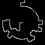

# Modeling and rendering with boxes - Fuccaro

![Preview Image of Project][id_prev]

##  Esecuzione

Per una corretta visualizzazione è necessario l'utilizzo di un web server, per esempio Xampp. Per ulteriori informazioni consultare la documentazione Threejs alla pagina [How to run things locally](https://threejs.org/docs/#manual/introduction/How-to-run-things-locally).

## Introduzione

All'avvio si presenta una scena, costruita esclusivamente da oggetti di tipo Boxes, con un labirinto, al cui centro troviamo un omino che durante l'animazione seguira un percorso verso l'uscita dal labirinto stesso. Più a destra troviamo un minotauro inanimato. L'animazione può essere controllata dall'utente, sia tramite tastiera (avviare, bloccare, resettare l'animazione) che tramite appositi controlli posti nella parte alta della schermata.

## Progettazione e Realizzazione

### Scenegraph

La prima fase della progettazione ha riguardato la costruzione dello Scenegraph, per facilitare la realizzazione del progetto finale e le relative animazioni.

### Personaggi

I due personaggi, l'omino e il minotauro, sono stati inizialmente progettati tramite schizzo su carta per poi essere riportati graficamente tramite l'[editor](https://threejs.org/editor/) Threejs, per avere una prima idea del risultato finale.

### Labirinto

Per la costruzione del labirinto è stata utilizzata una heightmap, reperita tramite il sito [Maze Generator](http://www.mazegenerator.net/) dove è possibile generare labirinti. Siccome l'immagine presentava una risoluzione troppo eleavata è stato necessario ridurne le dimensioni ad una 90x90 tramite il tool online [reduceimages](https://www.reduceimages.com/). Inoltre è stato necessario invertire i colori dell'immagine, per questo è stato utile il tool [pinetools invertimagecolors](http://pinetools.com/invert-image-colors).

Tramite il sito sopracitato Maze Generator è stato possibilie scaricare anche l'immagine con la soluzione. In questo caso è stato necessario eliminare il profilo del labirinto (tramite [Gimp](https://www.gimp.org)) e come fatto anche per il labirinto invertire i colori. L'utilizzo di questa heightmap verra trattato successivamente.

<table>
	<tr>
		<td>
		<figure>
			
			<figcaption>Immagine originale</figcaption>
		</figure>
		</td>
		<td>
		<figure>
			
			<figcaption>Heightmap labirinto</figcaption>
		</figure>
		</td>
		<td>
		<figure>
			
			<figcaption>Heightmap soluzione</figcaption>
		</figure>
</td>
	</tr>

</table>

### Textures

[id_prev]: screenshots/report/preview.png "mandi"
[id_or]: textures/circular/cLab+sol.png "ciao"
