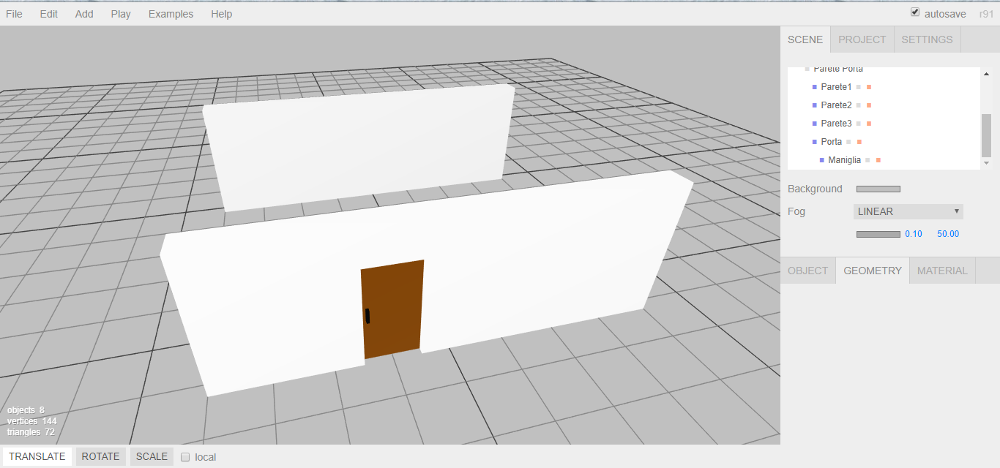
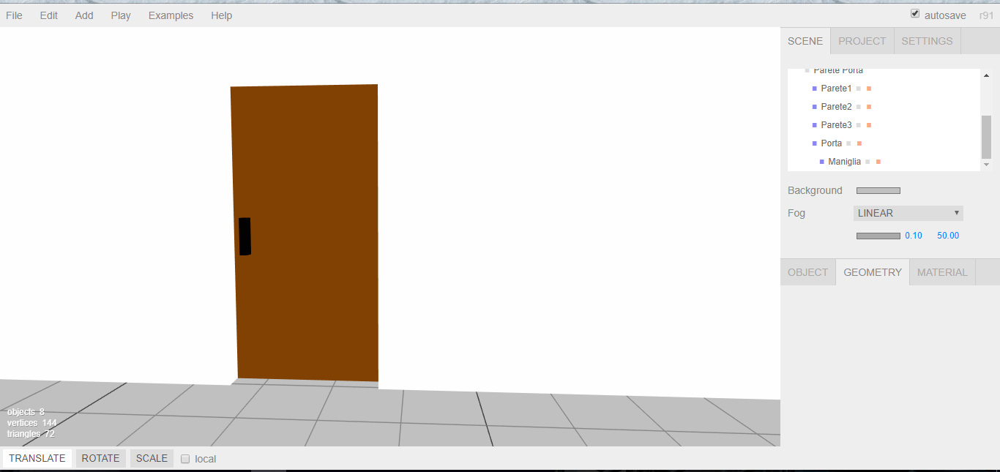

# 26 marzo 2018
Idea: simulazione minimale di una casa dotata di tecnologie di domotica
- Luci
- Appertura/chiusura carage/porte
- Elettrodomestici
- altro...

# 27 marzo 2018
- inizio creazione stanze (pareti e porte) con editor three.js
- create parete "piena" e parete con porta (scorrevole) sempre tramite l'editor

# 29 marzo 2018
- creata parete con finestra, finestra e tapparelle

[!Screenshot finestra con tapparella](./screenshots/screenshotTapparella.png)
[!Screenshot solo finestra](./screenshots/screenshotFinestra.png)

- prova caricamento dell'intera stanza con three.js senza luce ambientale e direzionale.
- prova cambio colore del terreno

[!Screenshot stanza dall'alto](./screenshots/screenshotStanza1.png)
[!Screenshot stanza dettaglio porta](./screenshots/screenshotStanza2.png)
[!Screenshot stanza dettaglio finestra](./screenshots/screenshotStanza3.png)
