# 26 marzo 2018
Idea: simulazione minimale di una casa dotata di tecnologie di domotica
- Luci
- Appertura/chiusura carage/porte
- Elettrodomestici
- altro...

# 27 marzo 2018
- inizio creazione stanze (pareti e porte) con editor three.js
- create parete "piena" e parete con porta (scorrevole) sempre tramite l'editor

# 29 marzo 2018
- creata parete con finestra, finestra e tapparelle

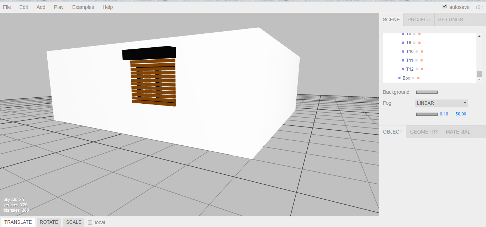
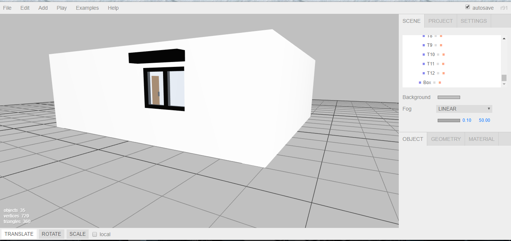

- prova caricamento dell'intera stanza con three.js senza luce ambientale e direzionale.
- prova cambio colore del terreno

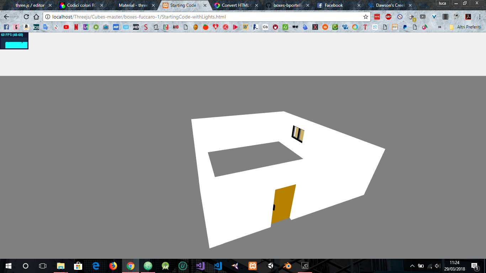
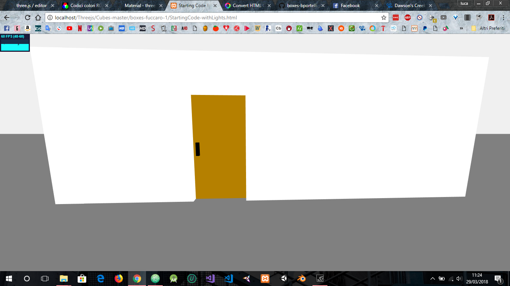
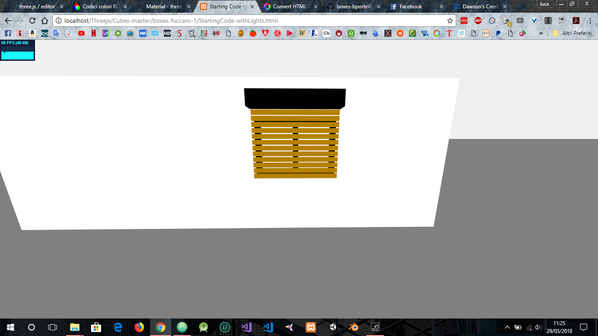

- finito di costruire il salotto con i relativi arredamenti (con l'editor) e prova con objectloader
    - piano tv
    - guardaroba
    - quadro (con texture)
    - divano con penisola
    - caminetto
    - portaombrelli

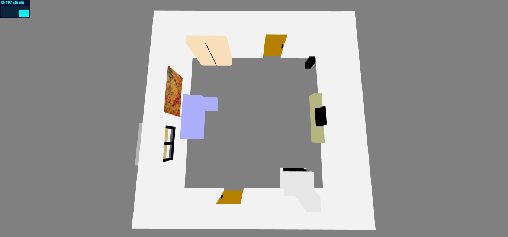
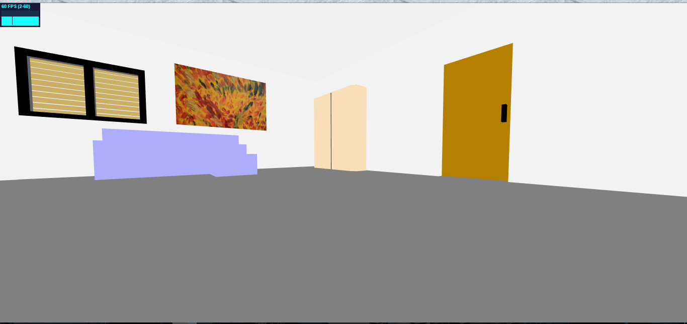

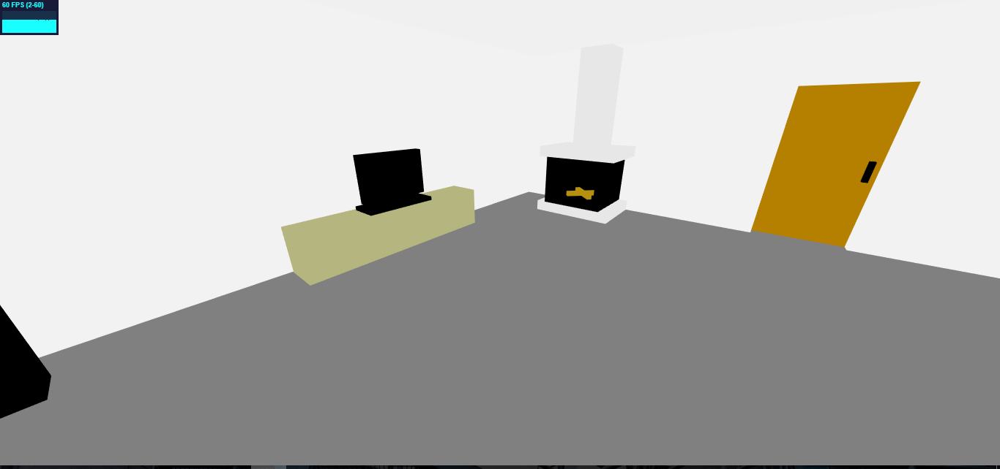

# 30 marzo 2018

- creata perete con vetrata
- ridisposizione mobili salotto
- creati mobili per la cucina
- create stanze bagno e camera da letto

# 31 marzo 2018

- finita disposizione delle stanze
- aggiunta garage

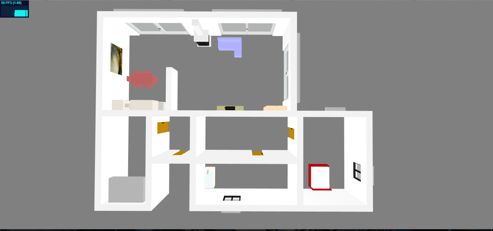

# 3 aprile 2018

- aggiunte luci e controlli utente per accensione e spegnimento delle luci stesse.

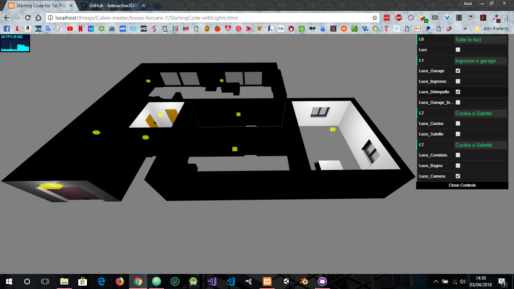

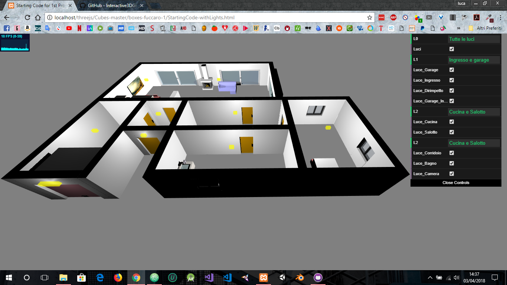

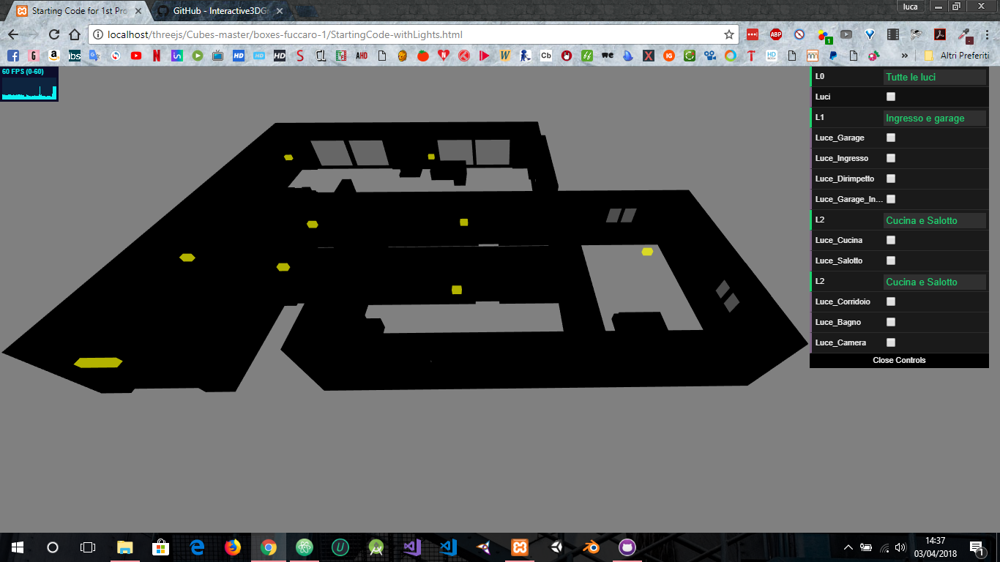
